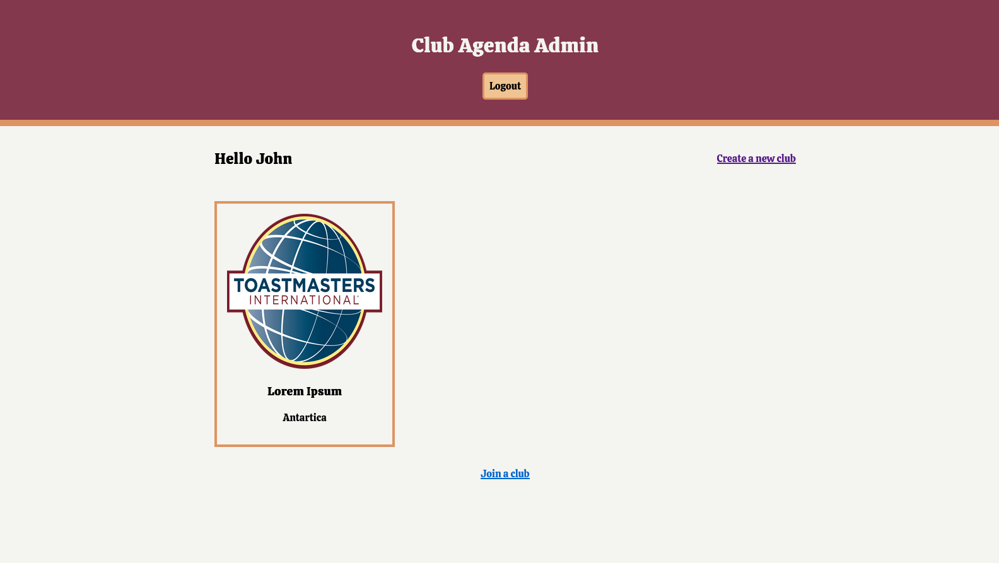
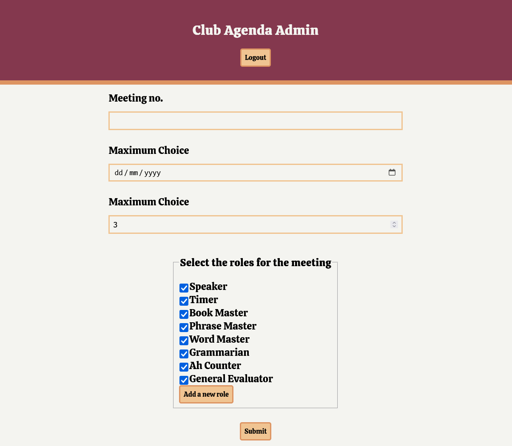
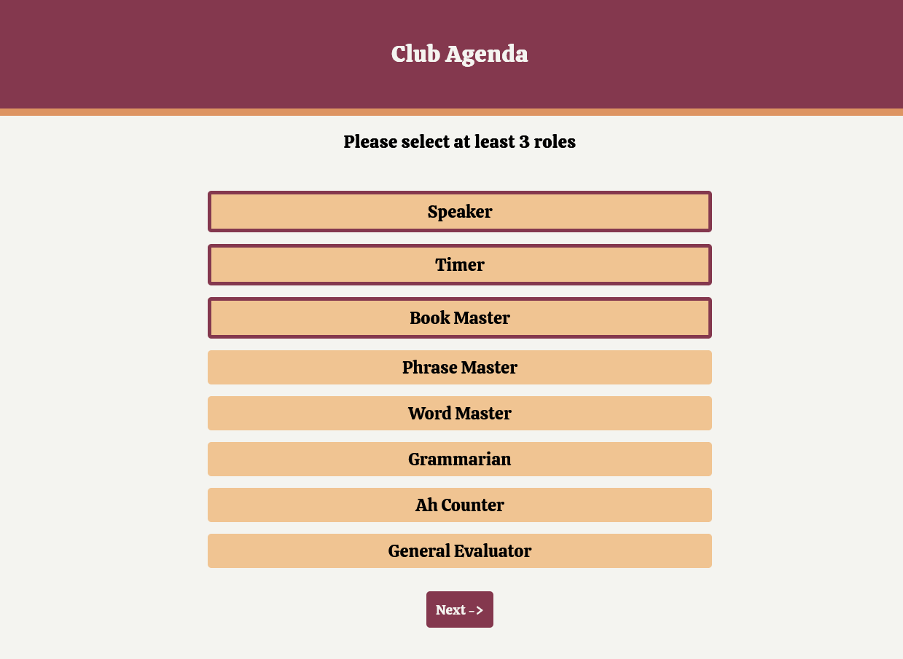
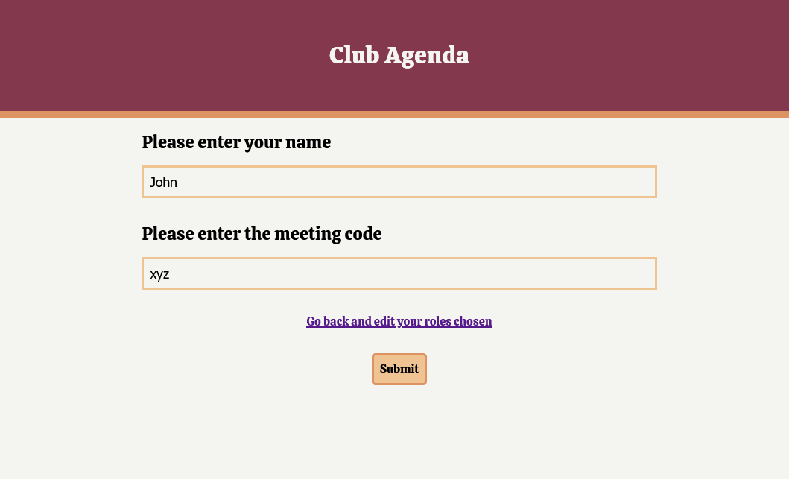

# tm-agenda-maker ⚡

> This project is still in beta

tm-agenda-maker is a project made to simplify toastmaster meeting agendas. With polling and other management options, club managers can cruise through making the agenda.

With the hassle of meeting roles taken away, club managers can now focus on what really matters to them - the quality.

## Startup

Once you've created a project and installed dependencies with `npm install` (or `pnpm install` or `yarn`), start a development server:

```bash
npm run dev

# or start the server and open the app in a new browser tab
npm run dev -- --open
```

## Screenshots










